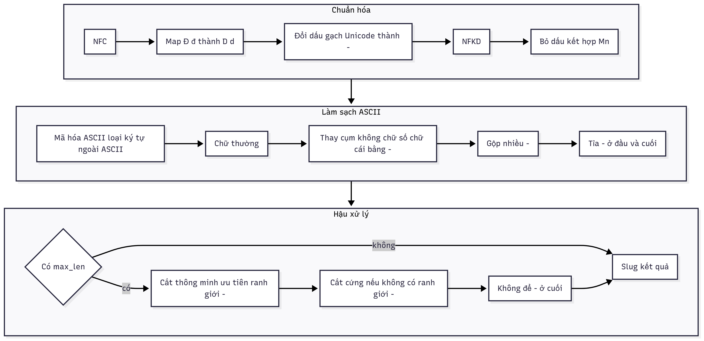

# Slugify Tiếng Việt

Dự án nhỏ bằng **Python** để chuyển đổi chuỗi tiếng Việt (có dấu, Unicode phức tạp, emoji, ký tự đặc biệt) thành **slug ASCII an toàn cho URL**.  
Bao gồm:

- `slugify.py`: module xử lý chính, hàm `slugify_tieng_viet(text, max_len=None, suffix_mode="none")`.
- `slugify_test.py`: bộ **unit test** với `pytest` (30+ case, kiểm tra bất biến, `max_len`…).
- `app.py`: ứng dụng **GUI Tkinter** để thử trực tiếp, có **Cấu hình** cho `max_len` và **suffix**.

---

## Clone dự án

```bash
git clone https://github.com/lenhattri/slugify-tieng-viet-demo.git
cd slugify-tieng-viet-demo
````

---

## Sơ đồ pipeline

Hàm `slugify_tieng_viet` xử lý theo chuỗi: **chuẩn hóa → làm sạch → gắn suffix (nếu có) → cắt thông minh → dọn dẹp lần cuối**.



---

## Cài đặt

Yêu cầu:

* Python >= 3.9
* Tkinter (thường có sẵn cùng Python)

Cài thêm `pytest` để chạy unit test:

```bash
pip install pytest
```

> Trên Windows, nên dùng:
>
> ```bash
> python -m pip install -U pytest
> ```

---

## Sử dụng module

```python
from slugify import slugify_tieng_viet

print(slugify_tieng_viet("Tôi Thấy Hoa Vàng Trên Cỏ Xanh"))
# -> "toi-thay-hoa-vang-tren-co-xanh"

print(slugify_tieng_viet("Xin chào 🌟🔥"))
# -> "xin-chao"

print(slugify_tieng_viet("đi-cho-nhanh", max_len=5))
# -> "di-cho" hoặc "di"

# Dùng suffix:
print(slugify_tieng_viet("Một bài viết", suffix_mode="random4"))
# -> "mot-bai-viet-a1b2" (ví dụ)
print(slugify_tieng_viet("Một bài viết", suffix_mode="date"))
# -> "mot-bai-viet-20250824" (ví dụ)
print(slugify_tieng_viet("Một bài viết", max_len=20, suffix_mode="random6"))
# suffix được tính vào độ dài cắt thông minh
```

### `suffix_mode` hỗ trợ

* `none` (mặc định): không gắn suffix
* `random4`: chuỗi hex ngẫu nhiên 4 ký tự
* `random6`: chuỗi hex ngẫu nhiên 6 ký tự
* `date`: yyyyMMdd
* `datetime`: yyyyMMddHHmm

> Lưu ý: suffix được gắn **sau khi làm sạch** nhưng **trước khi cắt `max_len`** → tổng chiều dài bao gồm cả suffix.

---

## Unit Test

File `slugify_test.py` có 30+ ca test: dữ liệu Việt hoá, dash Unicode, emoji, NFD vs NFC, bất biến, `max_len`…

Chạy test:

```bash
python3 -m pytest -q slugify_test.py
```

Ví dụ output:

```
................................................
52 passed in 0.45s
```

---

## Ứng dụng GUI (Tkinter)

`app.py` có:

* Ô “Đầu vào”
* Ô “Đầu ra”
* Nút **Submit** (phím tắt **Enter**)
* Nút **Xóa** (chỉ sáng khi đã có đầu ra)
* Nút toggle **Cấu hình** (`▼/▲ Cấu hình`)

  * `max_len` (để trống nếu không giới hạn)
  * `suffix` (dropdown: `none`, `random4`, `random6`, `date`, `datetime`)

Chạy app:

```bash
python app.py
```

---

## Ví dụ “ác mộng”

Input:

```
"  Đầy---ký—tự🤯  cực khó!!!   ŁắM liền – 12₫ @@   "
```

Output:

```
"day-ky-tu-cuc-kho-lam-lien-12"
```

---

## Cấu trúc thư mục

```
.
├── app.py               # GUI Tkinter
├── slugify.py           # Module slugify_tieng_viet (có suffix_mode)
├── slugify_test.py      # Unit test với pytest
├── sodo.png             # Sơ đồ pipeline dạng ảnh
└── README.md            # Tài liệu
```

---

## License

MIT

